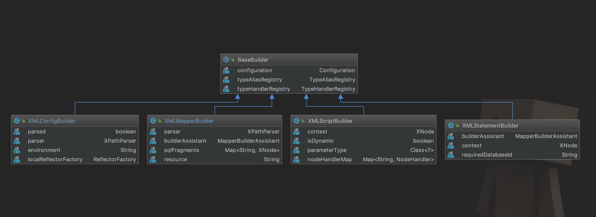

# Mybatis 源码阅读 一 Mybatis初始化与解析过程



- `XML***Builder`是用来解析 `xml` 配置文件的， 不同类型的 `XML***Builder` 用来解析不同的 `xml` 配置文件，
  比如: 
  `XMLConfigBuilder` 用来解析MyBatis的配置文件
  `XMLMapperBuilder` 用来解析MyBatis中的映射文件(`XXXMapper.xml`)
  `XMLStatementBuilder` 用来解析映射文件中的SQL语句。
- 这些 `XML***Builder` 都有一个共同的父类 ==> `BaseBuilder`。
  这个父类维护了一个全局的`Configuration`对象，MyBatis的配置文件解析后就以`Configuration`对象的形式存储。
- 当创建`XMLConfigBuilder`对象时，就会初始化`Configuration`对象，并且在初始化`Configuration`对象的时候，
  一些别名会被注册到`Configuration`的`typeAliasRegistry`容器中。


```java

class XMLConfigBuilder{
  // ****
  /**
   * 解析 mybatisConfig 配置文件
   * @param root
   */
  private void parseConfiguration(XNode root) {
    try {
      //issue #117 read properties first
      propertiesElement(root.evalNode("properties"));
      Properties settings = settingsAsProperties(root.evalNode("settings"));
      loadCustomVfs(settings);
      loadCustomLogImpl(settings);
      typeAliasesElement(root.evalNode("typeAliases"));
      pluginElement(root.evalNode("plugins"));
      objectFactoryElement(root.evalNode("objectFactory"));
      objectWrapperFactoryElement(root.evalNode("objectWrapperFactory"));
      reflectorFactoryElement(root.evalNode("reflectorFactory"));
      settingsElement(settings);
      // read it after objectFactory and objectWrapperFactory issue #631
      environmentsElement(root.evalNode("environments"));
      databaseIdProviderElement(root.evalNode("databaseIdProvider"));
      typeHandlerElement(root.evalNode("typeHandlers"));
      mapperElement(root.evalNode("mappers"));
    } catch (Exception e) {
      throw new BuilderException("Error parsing SQL Mapper Configuration. Cause: " + e, e);
    }
  }
}

```
XMLConfigBuilder 回一次解析配置文件的 各个节点.

